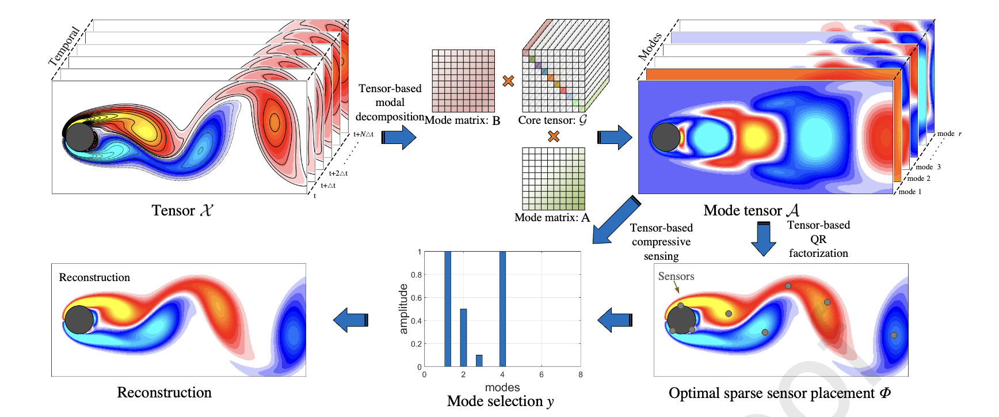

# Тензорное Модальное Разложение и Оптимальное Разреженное Размещение Датчиков

## Обзор

Данный проект посвящен разработке передовых методов анализа высокоразмерных динамических систем на основе тензорного представления данных. Основные вкладки этой работы можно суммировать следующим образом:

1. **Новый метод тензорного модального разложения (TBMD)**: Предложен новый метод для эффективного извлечения низкоразмерных мод, содержащих пространственно-временную информацию из высокоразмерных динамических систем.

2. **Тензорный метод QR-разложения с выбором трубок по третьему измерению**: Разработан тензорный метод QR-разложения для достижения оптимального размещения датчиков с учетом пространственной структуры и информации о соседних элементах базисных матриц в тензорной форме.

3. **Тензорная модель компрессивного измерения**: Построена модель компрессивного измерения для выполнения задач восстановления данных в матричной форме с ограниченными разреженными измерениями датчиков и данными словаря в тензорной форме.

4. **Экспериментальная валидация**: Предложенные методы были проверены экспериментально, что показало, что TBMD способен точно захватывать низкоразмерные многообразия, а тензорное QR-разложение эффективно оптимизирует размещение датчиков с меньшим количеством датчиков при сохранении высокой точности восстановления.

## Содержание

Проект организован следующим образом:

- **Раздел 1**: Введение в область исследования и необходимость применения продвинутых тензорных методов.
- **Раздел 2**: Подробное представление предложенных методов, включая TBMD, тензорное QR-разложение и тензорное компрессивное измерение.
- **Раздел 3**: Описание экспериментальной настройки и процедур, использованных для проверки предложенных методов.
- **Раздел 4**: Обсуждение производительности предложенных методов на пяти разных наборах данных.
- **Раздел 5**: Заключительные замечания и предложения для будущей работы.

## Методология

Общая интеграция тензорного модального разложения высокого порядка, тензорного QR-разложения и тензорного разреженного измерения иллюстрируется в проекте (см. Рисунок 1 для схематического представления).

<figure>
  
  <figcaption>Рисунок 1 - Процедура предлагаемого метода модальной декомпозиции и его применение для оптимального разреженного размещения датчиков.</figcaption>
</figure>

### Ключевые шаги:

1. **Извлечение низкоразмерных мод**: Применение тензорного модального разложения высокого порядка к динамической системе для получения низкоразмерных мод.

2. **Построение тензора словаря**: Использование полученных мод в качестве базисных матриц для построения тензора словаря.

3. **Оптимальное размещение датчиков**: Определение оптимального разреженного размещения датчиков путем выполнения QR-разложения с выбором трубок по третьему измерению тензора словаря.

4. **Тензорная модель компрессивного измерения**: Комбинирование полученной матрицы измерений датчиков и тензора словаря для построения тензорной модели компрессивного измерения.

5. **Решение задачи Lasso**: Применение метода попеременных направлений множителей (ADMM) для решения задачи Lasso, подтверждая эффективность оптимального размещения датчиков при восстановлении системы.

## Применение

Предложенные методы применимы к сложным динамическим системам, таким как:

- **Динамика жидкостей**: поля давления, температуры.
- **Структурный анализ**: поля напряжений, деформаций.

Эффективно извлекая существенную информацию и оптимизируя размещение датчиков, методы способствуют точному восстановлению и анализу этих систем с сокращением вычислительных ресурсов.

## Результаты экспериментов

Проведенные эксперименты показывают, что:

- **TBMD** эффективно захватывает низкоразмерные многообразия высокоразмерных данных.
- **Тензорное QR-разложение** успешно оптимизирует размещение датчиков, требуя меньше датчиков без ущерба для точности восстановления.
- Общий подход повышает эффективность и точность задач восстановления данных в высокоразмерных динамических системах.

## Заключение

Данная работа представляет значительные достижения в области тензорных методов анализа высокоразмерных динамических систем. Интеграция TBMD, тензорного QR-разложения и тензорного компрессивного измерения обеспечивает надежную основу для точного восстановления систем и оптимального размещения датчиков.
